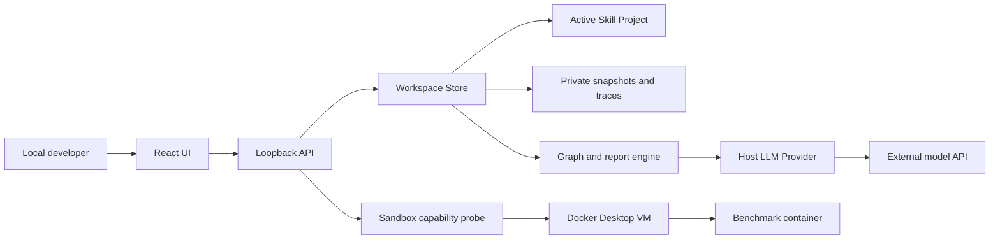

# Skill Designer Threat Model

## Executive summary

Skill Designer 是单用户、本机 loopback 开发工具；当前最高风险不是公网攻击，而是未来真实 Benchmark 执行不可信 Skill、脚本和工具时突破隔离，读取宿主凭据、修改 active 项目或耗尽资源。1.0 选择 Windows/macOS 均可用的 Docker Desktop `desktop-linux` VM 作为统一后端，并要求固定镜像、无网络、只读输入、独立产物目录和资源限制。当前仓库已实现 T35 生命周期和固定协议自检，但本开发机没有 Docker CLI，尚未取得真实容器负向验收证据；任何机器都不能仅凭能力探测或模拟执行器测试被标记为 Benchmark-ready。

## Scope and assumptions

- 范围：`packages/engine/src`、`packages/server/src`、`packages/web/src`，重点是 SandboxRunner、HTTP、本地文件、RuntimeArtifact、Trace、Bug Report 和 BenchmarkCase 边界。
- 已确认使用方式：开发者单人、本机运行；Windows 与 macOS 客户端；用户主动选择 Skill 和测试用例；真实 Benchmark 后续会调用真实模型并执行用户批准的工具。
- 部署假设：服务只监听 loopback，不经反向代理或局域网暴露；不是多人或多租户服务。
- 数据假设：项目可能包含私有代码、文档、API 凭据引用、模型对话和工具产物；长期 API Key 后续由系统凭据存储管理，不进入项目或 Trace。
- 范围外：T20 操作系统凭据库和其他 Provider、云端部署、多人权限、CI/CD 和 Docker Desktop/宿主内核自身漏洞修复；T35/T36 真实 Docker Desktop 端到端验收因当前机器缺少 Docker 而待补。
- 会改变评级的开放问题：未来是否允许沙箱内直接联网、是否支持自定义 runner 镜像、是否允许原生 Windows/macOS 工具链；任何一项为“允许”都需要重新评审 TM-001、TM-004、TM-005。

## System model

### Primary components

- React Web UI 通过同源 API 管理 Workspace、Skill、设计助手、测试、报告和能力状态（证据：`packages/web/src/api.ts`、`packages/web/src/App.tsx`、`packages/web/src/components/DesignAssistantDrawer.tsx`）。
- Node HTTP/WebSocket 服务只接受本机 Host、允许的 Origin 和随机 session token（证据：`packages/server/src/http.ts` 的 `createApp`、`validateHost`、`validateOrigin`）。
- WorkspaceStore 管理 active 项目、私有 revision/snapshot、Trace、报告和 ChangeSet（证据：`packages/server/src/store.ts` 的 `WorkspaceStore`）。
- Engine 提供纯图运行、Trace、报告脱敏、BenchmarkCase 校验和沙箱策略/命令计划（证据：`packages/engine/src/runtime.ts`、`report.ts`、`benchmark.ts`、`sandbox.ts`）。
- SandboxCapabilityService 探测本机 Docker Desktop，SandboxControlService 和 DockerDesktopSandboxRunner 管理固定自检及容器生命周期；只有真实自检通过才报告 Benchmark-ready（证据：`packages/server/src/sandbox.ts`、`sandbox-control.ts`、`sandbox-runner.ts`）。
- BenchmarkRunnerService 管理单并发队列、preflight、snapshot 冻结、模型/沙箱编排、usage、断言和 Benchmark Trace；修复验证的专用 post-repair lineage 绑定报告来源、repair、ChangeSet 与 revision，并由 Store 重新读取父子 Artifact 防止伪造结果；OpenAIResponsesProvider 是首个宿主 Provider 适配器（证据：`packages/server/src/benchmark-runner.ts`、`store.ts`、`model-provider.ts`）。

### Data flows and trust boundaries

- 浏览器 → 本地 HTTP 服务：Workspace/Skill/报告/测试 JSON 和 Benchmark 人工复核；HTTP loopback，Host/Origin/session token 校验，请求体 2 MiB、导入 24 MiB 上限和结构校验。人工复核只允许追加到 `completed` 运行，不能改写自动断言或技术状态。
- 用户文件 → WorkspaceStore：导入文件、原地项目和 Bug Report；路径规范化、数量/大小/Schema/稳定 ID 校验。原地打开先拒绝项目内符号链接，后续项目读取再从授权根逐级 `lstat`，Snapshot 同样拒绝符号链接，防止加入后的链接替换逃逸。
- WorkspaceStore → 项目文件：只有 ChangeSet 确认后写入；绑定 projectId/skillId/baseRevision/digest，并使用原子写。文档重命名/删除只接受项目内 Markdown 路径，保护 `SKILL.md`，并把源、目标和图引用纳入同一回滚集合。
- WorkspaceStore → Studio 私有数据：RuntimeArtifact、Trace、报告、夹具、revision；保存在本机数据目录，不进入通用导出包。
- 服务 → 外部模型 Provider：设计助手只发送锁定 Skill 的有界图/文档/用例上下文，不发送其他成员正文；结构化回复的 evidence 和操作由服务重新校验，且只能生成未确认 ChangeSet。会话列表先按 workspaceId 过滤且只返回摘要；同会话只允许一个在途请求，取消信号直达 Provider，并在创建 ChangeSet 前复核 abort 状态（证据：`packages/server/src/design-assistant.ts`）。
- 服务 → Docker Desktop：固定 `desktop-linux` 本机 socket 的 CLI 探测；清除 Docker 环境覆盖，不使用 shell，不接受远程 context。
- SandboxRunner → 容器 VM：只读 snapshot 私有副本、独立可写 output、只读 root、无网络、受限资源；代码已实现，当前机器尚未完成真实容器负向验收。
- 宿主 LLM Provider → OpenAI Responses API：携带服务端环境中的凭据、当前节点按需上下文和严格结构化决策；固定官方 endpoint，不经过沙箱网络，Key/header/原始请求正文不写 Trace。

#### Diagram

## Assets and security objectives

| Asset | Why it matters | Security objective (C/I/A) |
|---|---|---|
| Active Skill 项目 | 用户真实源码和文档；错误写回会破坏工作 | I/A |
| 宿主文件与系统凭据 | 可能包含 API Key、SSH key、浏览器和云凭据 | C/I |
| RuntimeArtifact 与 revision | 决定测试实际执行的版本和可追溯性 | I/A |
| BenchmarkCase 与结果 | 决定工具是否被用户信任和发布 | I |
| Trace、对话、Bug Report | 可能包含业务数据和敏感输出 | C/I |
| Docker daemon/VM | 是不可信代码与宿主之间的主要隔离边界 | I/A |
| LLM Provider 凭据和 token 计量 | 泄露导致费用和数据风险，篡改导致虚假结果 | C/I/A |
| 审计事件和清理状态 | 用于证明越权、取消和残留进程情况 | I/A |

## Attacker model

### Capabilities

- 提供恶意或被污染的 Skill、Markdown、图、BenchmarkCase、Bug Report、脚本和工具参数。
- 控制未来模型回复，使其尝试非法路径、命令、网络访问或提示注入。
- 诱导用户打开恶意网页并向 localhost 发请求，但不能直接读取随机 session token。
- 在容器内执行任意非特权代码，并尝试利用挂载、内核/运行时漏洞或资源耗尽影响宿主。
- 同一宿主上的其他低权限进程可能竞争端口、修改用户 PATH 或干扰 Docker 配置。

### Non-capabilities

- 在既定部署中不能从公网直接连接服务，也不存在跨租户身份越权。
- 不假设攻击者已取得当前 OS 用户权限；若已取得，该用户本就能读写本项目和 Docker 配置，部分边界不再成立。
- 当前 T34 不执行容器、不拉镜像、不调用模型，因此容器逃逸和模型费用风险尚未成为可达运行路径。

## Entry points and attack surfaces

| Surface | How reached | Trust boundary | Notes | Evidence (repo path / symbol) |
|---|---|---|---|---|
| HTTP/JSON API | 浏览器 fetch | Browser → API | Host、Origin、token、body limit | `packages/server/src/http.ts:createApp/readJson` |
| Trace WebSocket | 测试页连接 | Browser → API | 子协议携带 token，run/project 身份复核 | `packages/server/src/http.ts:attachTraceSocket` |
| Skill 文件夹导入 | 文件选择器 | User files → Store | 最多 500 文件、路径与总大小校验 | `packages/server/src/store.ts:parseSkillImportInput` |
| 原地打开与持续读取 | 绝对路径输入、外部工具修改工作树 | Host filesystem → Store | 根 realpath、核心文件与全项目 symlink 拒绝；每次读取逐级 `lstat` | `packages/server/src/store.ts:openInPlaceProject/assertProjectReadPath` |
| ChangeSet 应用 | 明确确认 | Proposal → Active project | digest/baseRevision/skillId 校验、路径边界、文档/图引用重算、原子写与多文件回滚 | `packages/server/src/store.ts:confirmAndApplyChangeSet` |
| Bug Report 导入导出 | JSON 上传/下载 | Trace ↔ Transfer file | Schema/身份校验与强制密钥脱敏 | `packages/engine/src/report.ts`、`packages/server/src/store.ts:importBugReport` |
| Git 只读命令 | 工作区按钮 | Store → subprocess | 无 shell、清理 GIT 环境、限定 pathspec | `packages/server/src/git.ts:runGit` |
| Docker 能力探测 | 测试页按钮 | API → Docker CLI | 固定本机 context，无容器启动 | `packages/server/src/sandbox.ts:SandboxCapabilityService` |
| 容器运行 | Benchmark 启动 | Store → Docker VM | 固定镜像与参数、生命周期审计、隔离自检；当前机器未取得真实容器证据 | `packages/engine/src/sandbox.ts:buildDockerDesktopRunArguments`、`packages/server/src/sandbox-runner.ts` |

## Top abuse paths

1. 恶意 Skill 进入 Benchmark → 容器利用运行时漏洞或错误挂载 → 读取宿主凭据 → 凭据外泄或宿主被修改。
2. 攻击者构造 output 中的符号链接/特殊文件 → 收集阶段跟随到授权目录外 → 覆盖 active 项目或读取宿主文件。
3. 本地配置把 Docker context 指向远程 daemon → 服务发送包含项目 snapshot 的 bind 信息/任务 → 数据离开本机或在错误主机执行。
4. Skill fork bomb/内存炸弹/无限输出 → Docker VM、磁盘或 Node 服务耗尽 → 项目不可用且清理失败。
5. 未来为工具开放直接网络 → 恶意代码绕过宿主 Provider 审计 → 外传项目、探测内网或产生未计量流量。
6. 恶意网页向 localhost 发写请求 → 若 Origin/token 校验被绕过 → 创建 ChangeSet、导出报告或启动高成本任务。
7. 模型/工具输出把 Key 写入 Trace → 报告或结果导出 → 敏感凭据传播到工单或仓库。
8. 恶意导入路径或 symlink → 快照/导出遍历项目外 → 私有文件进入通用包。

## Threat model table

| Threat ID | Threat source | Prerequisites | Threat action | Impact | Impacted assets | Existing controls (evidence) | Gaps | Recommended mitigations | Detection ideas | Likelihood | Impact severity | Priority |
|---|---|---|---|---|---|---|---|---|---|---|---|---|
| TM-001 | 容器内恶意代码 | T35 启用真实执行；Docker/内核或配置存在突破路径 | 逃逸 VM/容器或访问 daemon | 宿主凭据泄露、任意修改 | 宿主、daemon、active 项目 | 固定 digest、`--cap-drop ALL`、no-new-privileges、非 root、只读 root；固定自检控制 ready 状态（`engine/src/sandbox.ts`、`server/src/sandbox-control.ts`） | 当前机器无真实容器自检证据；标准 ECI 非强制 | 禁止挂载 docker socket；只接受 `desktop-linux`；定期固定 runner digest；记录隔离级别；高风险用户可要求 ECI | 容器退出原因、daemon 事件、异常宿主文件访问 | 中：需真实执行和逃逸/误配 | 高 | high |
| TM-002 | 恶意产物 | collector 跟随 symlink、device、hardlink 或路径穿越 | 从 output 逃离授权根 | 读取/覆盖宿主文件 | active 项目、宿主文件 | output 使用独立临时目录；collector 只打开 `nlink=1` 的普通文件，拒绝 symlink/hardlink/device/socket，限制 500 文件和 64 MiB，并通过文件描述符计算摘要（`server/src/sandbox-runner.ts`） | Windows/macOS Docker Desktop 文件共享语义仍需真实平台负向测试 | 在 Windows/macOS Docker Desktop 上跑路径穿越和恶意产物集 | 审计每个拒绝产物和规范化路径 | 中 | 高 | high |
| TM-003 | 本地 Docker 配置污染 | 同一用户或软件修改 context/env | 指向远程/非 Desktop daemon | 数据发往错误主机，隔离声明失真 | 项目 snapshot、执行完整性 | 清除 DOCKER_* 环境；固定 `desktop-linux`；校验 unix/npipe 本机 endpoint（`server/src/sandbox.ts`） | context 文件仍属于当前用户信任面 | T35 再读取 endpoint 并与 probe 结果绑定；任务期间禁止 context 漂移；记录 daemon ID/version | context/daemon 指纹变化告警 | 低：需本地同用户影响 | 高 | medium |
| TM-004 | 恶意 Skill/模型输出 | 可执行循环、fork、海量文件/日志 | 耗尽 CPU、内存、PID、磁盘或时间 | Benchmark/应用不可用，残留进程 | Docker VM、磁盘、服务可用性 | 命令计划含 memory/cpu/pids/timeout/tmpfs；stdout/stderr 各限 256 KiB，产物限 500 文件/64 MiB；取消后强制删除并 inspect 复核（`engine/src/sandbox.ts`、`server/src/sandbox-runner.ts`） | output 写入期间缺少宿主侧实时磁盘配额；真实超时/强杀尚未验收 | 增加 Docker volume/宿主目录配额或运行中监控；在真实后端验证 fork、磁盘、日志、超时和取消 | 资源高水位、超时、强杀和清理失败事件 | 高 | 中 | high |
| TM-005 | 恶意工具或提示注入 | T36 开放模型/工具网络 | 借宿主 Provider 或代理外传数据/访问内网 | 数据泄露、费用和 SSRF | 项目、凭据、网络 | 沙箱默认 `network=none`；首个 Provider 固定官方 Responses endpoint，`store:false`、严格 JSON Schema，模型只能选择合法出口；action 命令来自已确认图并受沙箱 allowlist 限制（`model-provider.ts`、`benchmark-runner.ts`） | 设计助手工具、其他 Provider 和未来受控代理尚未实现；发送到模型的项目正文仍属于明确外发 | 用户配置时明确 Provider 数据边界；新增 Provider 禁止任意 base URL；未来代理做域名/IP 双重 allowlist并拒绝内网 | Provider、模型、token、调用次数、失败类型和重复调用 | 中 | 高 | high |
| TM-006 | 恶意网页/本地进程 | 用户浏览恶意站点；服务正在运行 | CSRF、DNS rebinding 或 token 获取 | 未授权修改/执行/导出 | 项目、报告、模型费用 | loopback、Host/Origin、随机 token、CSP（`server/src/http.ts`） | `/api/session` 依赖 Origin 边界；无请求速率限制 | 保持精确 Origin；桌面壳采用一次性交换码；敏感操作继续二次 digest 确认；加入并发/速率限制 | invalid_host/origin/token 计数与敏感操作审计 | 低 | 高 | medium |
| TM-007 | 恶意导入文件或加入后的工作树替换 | 用户导入不可信目录/报告，或外部工具修改 in-place 项目 | 路径穿越、symlink、超大输入、身份混淆或读取时 TOCTOU | 项目外读写、DoS、错误绑定 | 项目、私有数据、可用性 | body/file count/size/path/ID 校验；skillId 精确匹配；打开、修复、Snapshot 和项目读取拒绝 symlink；读取前从授权根逐级 `lstat`，目录遍历遇到链接整体失败（`http.ts`、`store.ts`） | 同一用户仍可在校验和实际 open 之间极短竞争替换普通文件；导入结构化解析尚无统一嵌套深度上限 | 对高价值读取逐步采用文件描述符校验；导入解析增加深度/字段上限；继续用 revision/Snapshot 隔离普通文件漂移 | `project_symlink_unsupported`、导入拒绝码、外部变化和 snapshot hash 差异 | 低 | 中 | medium |
| TM-008 | 模型/工具/用户文本 | 敏感值进入事件、日志、人工复核或报告 | 通过报告、导出、错误详情泄露 | 凭据和业务数据泄露 | API Key、Trace、人工复核、报告 | forbidden-key 和报告强制脱敏；Provider header/Key/原始输入不入 Trace，Provider 错误会替换 Key 形态；产物断言只持久化 path/size/hash；人工复核 Trace 只记录 reviewId、结论和 noteLength，不复制备注正文；Benchmark Report 复用同一事件字段/文本脱敏并要求用户预览和 digest 确认（`report.ts`、`model-provider.ts`、`benchmark.ts`、`benchmark-runner.ts`） | 人工备注仍以本地运行记录原文持久化；二进制附件尚无扫描；默认模式会保留 engine 结构字段，未来新增结构字段需重新分类 | 人工备注导出前分类和脱敏；工具输出默认敏感；附件按 MIME/大小扫描；新增事件类型进入报告前补脱敏测试 | 脱敏计数、敏感模式命中、导出前禁 Key 扫描 | 中 | 高 | high |

## Criticality calibration

- **critical**：无需用户确认即可从网络获得宿主 RCE；默认 Benchmark 可稳定逃逸并读取系统凭据；session/token 校验可被远程绕过并启动任意命令。
- **high**：需要用户导入/运行恶意 Skill，但可突破容器或 collector 写出授权根；可外传项目/API Key；可稳定耗尽主机且取消无法清理。
- **medium**：需要同一 OS 用户先篡改 Docker context；恶意文件造成单项目破坏但 revision 可恢复；localhost CSRF 需要多个前提且仍有确认门槛。
- **low**：仅暴露非敏感版本/能力信息；容易恢复的单次任务失败；攻击者已经拥有与应用等价的当前用户文件权限且没有新增能力。

## Focus paths for security review

| Path | Why it matters | Related Threat IDs |
|---|---|---|
| `packages/engine/src/sandbox.ts` | 生成实际容器安全参数，任何遗漏都会弱化声明 | TM-001, TM-004, TM-005 |
| `packages/server/src/sandbox.ts` | Docker endpoint、daemon 和能力声明的信任根 | TM-001, TM-003 |
| `packages/server/src/http.ts` | localhost 身份边界、上传限制和未来任务端点 | TM-006, TM-007 |
| `packages/server/src/store.ts` | 文件边界、snapshot、ChangeSet、collector 后续落点 | TM-002, TM-007 |
| `packages/server/src/git.ts` | 当前唯一 subprocess 模式，可复用其无 shell/环境清理原则 | TM-003, TM-004 |
| `packages/engine/src/report.ts` | Trace 和报告的密钥脱敏边界 | TM-008 |
| `packages/engine/src/benchmark.ts` | 不可信用例与路径/断言校验 | TM-004, TM-005, TM-007 |
| `packages/web/src/api.ts` | session token 和所有浏览器请求的统一入口 | TM-006 |
| `packages/server/test/sandbox.test.ts` | 平台/context 负向能力测试 | TM-001, TM-003 |
| `scripts/chrome-verify.mjs` | 可见页面验收与敏感流程回归；属于测试而非运行时控制 | TM-006, TM-008 |

## Notes on use

- 已覆盖发现的 HTTP、WebSocket、文件导入、原地项目、ChangeSet、Git、报告、Docker 探测和未来容器边界。
- 已区分当前 T35/T36 代码能力、T37 人工复核与 T38 Benchmark Report 能力、尚未完成的真实容器/真实模型端到端验收和 Chrome/测试替身；测试通过不等于沙箱或真实 Benchmark 证明。
- 用户已在前序设计确认中明确单人、本地、Windows/macOS 和真实模型 Benchmark，因此未重复询问这些上下文。
- T35 勾选完成前必须在实际 Windows/macOS Docker Desktop 环境验证文件、网络、进程、资源、取消和清理负向场景，并据结果重评 TM-001/002/004。
- 平台事实依据：[Docker Desktop Enhanced Container Isolation](https://docs.docker.com/enterprise/security/hardened-desktop/enhanced-container-isolation)、[Docker resource constraints](https://docs.docker.com/engine/containers/resource_constraints/)、[Windows Sandbox configuration](https://learn.microsoft.com/en-us/windows/security/application-security/application-isolation/windows-sandbox/windows-sandbox-configure-using-wsb-file)。
